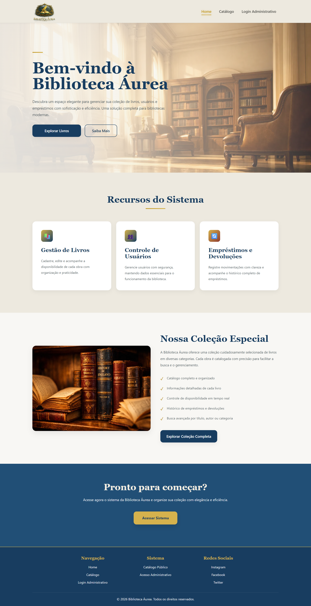

# 📚 Biblioteca Áurea

[](https://github.com/felipe-frc/biblioteca-aurea/actions)

Sistema web de gerenciamento de biblioteca desenvolvido com **ASP.NET Core MVC**, **Entity Framework Core** e **Azure SQL Server**, com foco em arquitetura em camadas, regras de negócio, testes automatizados, deploy em nuvem e boas práticas de Engenharia de Software.

O projeto permite controlar livros, usuários e empréstimos, aplicando validações importantes como indisponibilidade de livros emprestados, bloqueio de exclusão quando há histórico vinculado, prevenção de devoluções duplicadas e persistência dos dados em banco relacional na nuvem.

---

## 🌐 Acesse o Projeto

🔗 **Deploy:** [Biblioteca Áurea no Azure](https://biblioteca-aurea-gec0a3cnafddecgz.brazilsouth-01.azurewebsites.net/)

📂 **Repositório:** [github.com/felipe-frc/biblioteca-aurea](https://github.com/felipe-frc/biblioteca-aurea)

A aplicação está publicada no **Azure App Service** e utiliza **Azure SQL Server** como banco de dados.

A connection string real não é armazenada no repositório por segurança. Para executar localmente, siga as instruções da seção **Como Executar no VS Code**.

---

## 📌 Objetivo do Projeto

Este projeto foi desenvolvido com o objetivo de praticar e demonstrar conhecimentos em:

- Desenvolvimento web com ASP.NET Core MVC;
- Persistência de dados com Entity Framework Core e Azure SQL Server;
- Configuração segura de connection string com User Secrets;
- Organização em camadas e separação de responsabilidades;
- Criação de regras de negócio para um domínio real;
- Testes automatizados com xUnit;
- Integração contínua e deploy automatizado com GitHub Actions;
- Publicação de aplicação web em ambiente de nuvem;
- Documentação técnica para portfólio profissional.

---

## 🚀 Funcionalidades

### 📚 Livros

- Cadastro, listagem, edição e exclusão de livros;
- Cadastro de dados bibliográficos completos:
  - Título;
  - Autor;
  - Editora;
  - Edição;
  - Data completa de publicação;
  - Número de páginas;
- Controle automático de disponibilidade;
- Livro fica indisponível ao ser emprestado;
- Livro volta a ficar disponível após devolução;
- Bloqueio de exclusão quando existe histórico de empréstimos vinculado;
- Paginação na listagem de livros.

### 👥 Usuários

- Cadastro, listagem, edição e exclusão de usuários;
- Validação de dados cadastrais;
- Validação de e-mail;
- Bloqueio de exclusão quando existe histórico de empréstimos vinculado.

### 🔄 Empréstimos

- Criação e listagem de empréstimos;
- Registro de devoluções;
- Validação contra data retroativa;
- Validação contra empréstimo de livro indisponível;
- Validação contra devolução duplicada;
- Controle de status do empréstimo;
- Atualização automática da disponibilidade do livro;
- Mensagens de sucesso e erro com Bootstrap Alerts.

---

## 🛠️ Tecnologias

| Camada | Tecnologia |
|---|---|
| Linguagem | C# / .NET 8 |
| Framework Web | ASP.NET Core MVC |
| ORM | Entity Framework Core |
| Banco de Dados | Azure SQL Server |
| Deploy | Azure App Service |
| Segurança de configuração | User Secrets |
| Testes | xUnit |
| CI/CD | GitHub Actions |
| Front-end | Bootstrap 5 + Razor Views |
| Versionamento | Git / GitHub |

---

## 🏗️ Arquitetura

O projeto utiliza uma organização em camadas para separar responsabilidades e facilitar manutenção, testes e evolução.

```txt
biblioteca-aurea/
│
├── Biblioteca/               # Domínio — entidades, contratos e regras de negócio
│   ├── Domain/Entities/      # Livro, Usuario, Emprestimo
│   ├── Domain/Enums/         # StatusEmprestimo
│   └── Services/             # Serviços de domínio e validações
│
├── Biblioteca.Web/           # Aplicação web MVC
│   ├── Controllers/          # Controllers da aplicação
│   ├── Views/                # Razor Views
│   ├── ViewModels/           # ViewModels utilizados nas telas
│   ├── Data/                 # DbContext e migrations do EF Core
│   ├── Services/             # Serviços de aplicação
│   ├── wwwroot/              # Arquivos estáticos
│   └── Program.cs            # Configuração da aplicação e injeção de dependência
│
├── Biblioteca.Tests/         # Testes automatizados com xUnit
│   └── ...                   # Testes de regras de negócio e fluxos principais
│
├── docs/images/              # Imagens utilizadas na documentação
│
├── .github/workflows/        # Pipeline de CI/CD
│   └── main_biblioteca-aurea.yml
│
└── Biblioteca.sln            # Solution do projeto
```

---

## 📸 Interface do Sistema

### 🏠 Home

Tela inicial do sistema Biblioteca Áurea, com apresentação do projeto e acesso às principais áreas do sistema.

<p align="center">
  
</p>

---

### 📋 Listagem de Livros

Tela de listagem de livros com paginação, disponibilidade e dados bibliográficos completos, incluindo editora, edição, data de publicação e número de páginas.

<p align="center">
  
</p>

---

### ➕ Cadastro de Livro

Tela de cadastro de livro com os campos de título, autor, editora, edição, data de publicação e número de páginas.

<p align="center">
  
</p>

---

### ✏️ Edição de Livro

Tela de edição dos dados bibliográficos do livro.

<p align="center">
  
</p>

---

### 👨🏻‍💻 Listagem de Usuários

Tela de listagem de usuários cadastrados, com indicadores e ações de edição e exclusão.

<p align="center">
  
</p>

---

### ➕ Cadastro de Usuário

Tela de cadastro de usuário com validação dos dados principais.

<p align="center">
  
</p>

---

### ✏️ Edição de Usuário

Tela de edição dos dados cadastrais do usuário.

<p align="center">
  
</p>

---

### 🔄 Controle de Empréstimos

Tela de controle de empréstimos, com listagem, status, devolução e indicadores.

<p align="center">
  
</p>

---

### ➕ Novo Empréstimo

Tela de registro de novo empréstimo, vinculando usuário e livro disponível.

<p align="center">
  
</p>

---

## ⚙️ Como Executar no VS Code

### Pré-requisitos

- .NET 8 SDK;
- VS Code;
- Extensão C# para VS Code;
- Git instalado;
- Entity Framework Core CLI;
- Banco Azure SQL Server configurado.

Caso ainda não tenha o Entity Framework CLI instalado, execute:

```bash
dotnet tool install --global dotnet-ef
```

---

### 1. Clone o repositório

```bash
git clone https://github.com/felipe-frc/biblioteca-aurea.git
cd biblioteca-aurea
```

---

### 2. Restaure as dependências

```bash
dotnet restore
```

---

### 3. Configure a connection string com User Secrets

Por segurança, a connection string real não fica salva no `appsettings.json`.

Entre na pasta do projeto web:

```bash
cd Biblioteca.Web
```

Inicialize o User Secrets, caso ainda não esteja configurado:

```bash
dotnet user-secrets init
```

Configure a connection string do Azure SQL:

```bash
dotnet user-secrets set "ConnectionStrings:DefaultConnection" "SUA_CONNECTION_STRING_DO_AZURE_SQL"
```

O arquivo `appsettings.json` deve permanecer com um valor genérico:

```json
{
  "ConnectionStrings": {
    "DefaultConnection": "CONFIGURE_A_CONNECTION_STRING_IN_USER_SECRETS_OR_AZURE"
  },
  "Logging": {
    "LogLevel": {
      "Default": "Information",
      "Microsoft.AspNetCore": "Warning"
    }
  },
  "AllowedHosts": "*"
}
```

---

### 4. Aplique as migrations no banco

Ainda dentro de `Biblioteca.Web`, execute:

```bash
dotnet ef database update
```

Ou, a partir da raiz do repositório:

```bash
dotnet ef database update --project Biblioteca.Web --startup-project Biblioteca.Web
```

---

### 5. Execute a aplicação

Dentro de `Biblioteca.Web`, execute:

```bash
dotnet run
```

Ou, a partir da raiz do repositório:

```bash
dotnet run --project Biblioteca.Web
```

Após iniciar, o terminal exibirá uma URL parecida com:

```txt
Now listening on: http://localhost:5026
```

Abra essa URL no navegador:

```txt
http://localhost:5026
```

---

### 6. Execute os testes

A partir da raiz do repositório, execute:

```bash
dotnet test
```

---

## ✅ Qualidade e Testes

O projeto possui testes automatizados com **xUnit** para validar regras importantes do domínio, como:

- Bloqueio de empréstimo para livro indisponível;
- Validação de devolução de empréstimos;
- Prevenção de devolução duplicada;
- Validação de dados obrigatórios;
- Validação de regras relacionadas ao histórico de empréstimos;
- Regras de criação e atualização de livros;
- Proteção contra regressões em fluxos principais.

Além disso, a pipeline de **GitHub Actions** executa build, testes e deploy automaticamente a cada alteração enviada para a branch `main`.

---

## 🧠 Decisões de Desenvolvimento

### Arquitetura em camadas

A separação entre `Biblioteca`, `Biblioteca.Web` e `Biblioteca.Tests` foi adotada para manter o projeto mais organizado, desacoplado e testável. As regras de negócio ficam concentradas no domínio, evitando dependência direta da camada web.

### Entity Framework Core + Azure SQL Server

O projeto utiliza Entity Framework Core com Azure SQL Server, aproximando a aplicação de um cenário real de produção. As migrations foram configuradas para SQL Server, utilizando tipos adequados como `nvarchar`, `datetime2`, `int` e `bit`.

### Dados bibliográficos dos livros

A entidade `Livro` foi evoluída para armazenar informações mais completas, como editora, edição, data completa de publicação e número de páginas. Essa melhoria torna o cadastro mais realista e mais próximo de um sistema de biblioteca profissional.

### User Secrets e configuração no Azure

A connection string real não é armazenada no GitHub. Em ambiente local, o projeto utiliza User Secrets. No deploy, a connection string é configurada diretamente no Azure App Service, mantendo dados sensíveis fora do repositório.

### Testes com xUnit

O xUnit foi escolhido por sua integração com o ecossistema .NET e por permitir testar regras de negócio de forma objetiva. Os testes ajudam a proteger o sistema contra regressões durante futuras alterações.

### CI/CD com GitHub Actions

A integração contínua automatiza o processo de build, testes e deploy para o Azure App Service, aumentando a confiabilidade do repositório e demonstrando cuidado com qualidade de software.

### Bootstrap + Razor Views

O Bootstrap foi utilizado para acelerar a construção da interface e manter o foco principal do projeto em arquitetura, regras de negócio e persistência de dados.

---

## 🧾 Releases

### v2.4.0 — Dados bibliográficos dos livros

Versão que adicionou dados bibliográficos completos ao cadastro de livros, incluindo editora, edição, data completa de publicação e número de páginas.

### v2.3.0 — Deploy no Azure App Service

Versão responsável pela publicação da aplicação no Azure App Service com banco de dados Azure SQL Server e deploy automatizado via GitHub Actions.

---

## 📈 Melhorias Futuras

- Busca de livros por título, autor e editora;
- Filtros na listagem de livros por disponibilidade, autor, editora e data de publicação;
- Cadastro de categorias ou nichos de livros;
- Catálogo público para visitantes visualizarem livros disponíveis;
- Autenticação e autorização com ASP.NET Core Identity;
- Área administrativa protegida por login;
- Controle de permissões por perfil, como administrador e bibliotecário;
- Dashboard com indicadores de livros, usuários e empréstimos;
- Prazo previsto de devolução dos empréstimos;
- Identificação automática de empréstimos em atraso;
- API REST para consumo por aplicações externas;
- Melhorias de responsividade, acessibilidade e experiência do usuário;
- Configuração de domínio personalizado.

---

## 📄 Licença

Este projeto está sob a licença MIT. Veja o arquivo `LICENSE.txt` para mais detalhes.

---

## 👨‍💻 Autor

**Marcos Felipe França**

[LinkedIn](https://www.linkedin.com/) · [GitHub](https://github.com/felipe-frc)